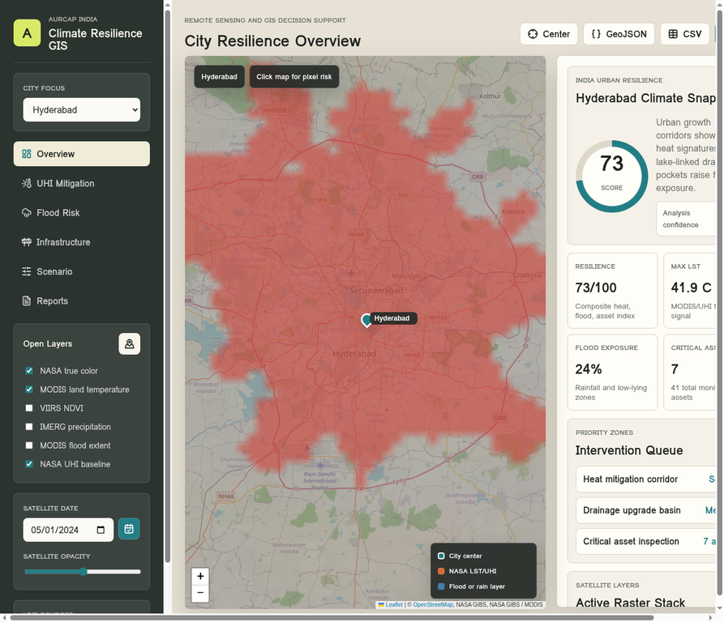

# AURCAP India GIS Climate Dashboard


[](https://opensource.org/licenses/MIT)
[](https://leafletjs.com/)
[](https://earthdata.nasa.gov/eosdis/science-system-description/eosdis-components/gibs)


An advanced, responsive GIS decision support system for urban climate resilience in India. This dashboard integrates multi-source satellite data to monitor Urban Heat Islands (UHI), flood risks, and infrastructure vulnerability across major Indian metropolitan areas.





## 🌟 Key Features


- **Multi-City Focus**: Real-time analysis for Delhi NCR, Mumbai, Hyderabad, Bengaluru, Chennai, Kolkata, Ahmedabad, Pune, and Guwahati.
- **Live Satellite Integration**: Direct WMTS feeds from NASA GIBS, including:
  - MODIS Terra Corrected Reflectance (True Color)
  - MODIS Land Surface Temperature (LST)
  - VIIRS NDVI (Vegetation Index)
  - IMERG Precipitation Rates
  - MODIS Combined Flood Extent
- **Interactive Analytics**:
  - **UHI Mitigation**: Identify thermal hotspots and cooling corridors.
  - **Flood Risk**: Monitor rainfall intensity and inundation zones.
  - **Infrastructure Health**: Track climate-exposed critical assets.
  - **Scenario Simulator**: Model adaptation strategies and benefit ratios.
- **Responsive Design**: Fully optimized for desktop, tablet, and mobile devices.
- **Data Export**: Export analysis results as GeoJSON or CSV for further GIS processing.


## 🚀 Getting Started


### Prerequisites


You need a simple static web server to run this project locally due to CORS and module requirements.


### Running Locally


1. Clone the repository:
   ```bash
   git clone https://github.com/nhasani92/aurcap-india-gis-dashboard.git
   cd aurcap-india-gis-dashboard
   ```


2. Start a local server:
   ```bash
   # Using Python
   python3 -m http.server 4173
   
   # Or using Node.js (if installed)
   npx serve .
   ```


3. Open your browser and navigate to `http://localhost:4173`.


## 📊 Data Sources & Tech Stack


| Component | Technology / Source |
| :--- | :--- |
| **Mapping Engine** | [Leaflet.js](https://leafletjs.com/) |
| **Satellite Imagery** | [NASA GIBS WMTS](https://earthdata.nasa.gov/gibs) |
| **Basemaps** | [OpenStreetMap](https://www.openstreetmap.org/) |
| **Icons** | [Lucide Icons](https://lucide.dev/) |
| **Styling** | Custom CSS with CSS Variables & Flexbox/Grid |


## 📱 Responsive Layout


The dashboard features a fluid layout that adapts to various screen sizes:
- **Desktop (>1140px)**: Full sidebar with map and side-by-side insight panel.
